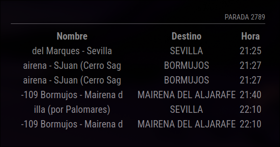

# MMM-Ctan
This [MagicMirror](https://github.com/MichMich/MagicMirror) module displays information about estimations for bus stops in Consorcio de Transportes de Andalucia. The service is provided by EMT Valencia. Supports Spanish (es).



## Dependencies
- An installation of [MagicMirror<sup>2</sup>](https://github.com/MichMich/MagicMirror)

## Installation

Navigate into your MagicMirror's `modules` folder:
```
cd ~/MagicMirror/modules
```

Clone this repository:
```
git clone https://github.com/Infinitte/MMM-Ctan.git
```

Navigate Navigate to the new `MMM-Ctan` folder and install the node dependencies.

Clone this repository:
```
npm install request
```

Configure the module in your `config.js` file.

### Update

```bash
cd ~/MagicMirror/modules/MMM-Ctan
git pull
```

## Find your stop number


## Using the module

To use this module, add it to the modules array in the `config/config.js` file. 

```javascript
modules: [
  {
    module: 'MMM-EMTValencia',
    position: 'top_left',
    header: 'My bus stop',
    config: {
      stopNumber: 683,
      stopLine: null,
      updateInterval: 10
    }
  },
]
```

## Configuration options

The following properties can be configured:

| Option                       | Description
| ---------------------------- | -----------
| `parada  `                   | ID number of the bus stop.<br><br>**Required**<br>**Value type:** `Integer`<br>**Default value:** `1`
| `consorcio`                  | Consorcio number.<br><br>**Required**<br>**Value type:** `Integer`<br>**Default value:** `7`
| `updateInterval`             | Time (in seconds) to wait before refreshing the data from the API.<br><br>**Required**<br>**Value type:** `Integer`<br>**Default value:** `300`

[mm]: https://github.com/MagicMirrorOrg/MagicMirror
